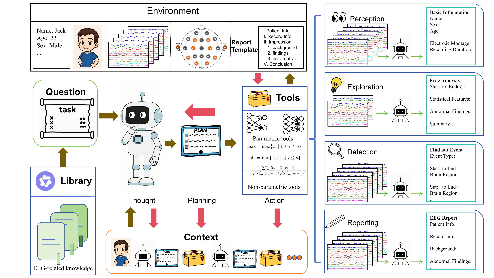

# EEGAgent Abstract
Scalable and generalizable analysis of brain activity is essential for advancing both clinical diagnostics and cognitive research. Electroencephalography (EEG), a non-invasive modality with high temporal resolution, has been widely used for brain states analysis. However, most existing EEG models are usually tailored for individual specific tasks, limiting their utility in realistic scenarios where EEG analysis often involves multi-task and continuous reasoning. In this work, we introduce EEG Agent, a general-purpose framework that leverages large language models (LLMs) to schedule and plan multiple tools to automatically complete EEG-related tasks. EEG Agent is capable of performing the key functions: EEG basic information perception, spatiotemporal EEG exploration, EEG event detection, interaction with users, and EEG report generation. To realize these capabilities, we design a toolbox composed of different tools for EEG preprocessing, feature extraction, event detection, etc. These capabilities were evaluated on public datasets, and our EEG Agent can support flexible and interpretable EEG analysis, highlighting its potential for real-world clinical applications.

# EEGAgent Framwork


# Project Structure
```
EEGAgent/
├─ main.py                 # Main project entry point
├─ prompt.py               # Prompt construction and management
├─ MDD_eval.py             # Evaluation pipeline for MDD task
├─ Sleep_eval.py           # Evaluation pipeline for sleep staging
├─ TUSL_eval.py            # Evaluation pipeline for TUSL task
├─ README.md               # Project documentation
├─ __init__.py

├─ config/
│  └─ config.json          # Global configuration and parameters

├─ data/                   # Raw EEG data files
│  ├─ *.edf / *.rec        # Raw EEG recordings
│  └─ edf/                 # Additional EDF files

├─ eval/                   # Training and evaluation modules
│  ├─ MDD/
│  │  ├─ train.py
│  │  ├─ predeal.py
│  │  ├─ README
│  │  ├─ checkpoints/
│  │  └─ data/, raw/
│  └─ sleep/
│     ├─ train.py
│     ├─ predeal.py
│     ├─ README
│     ├─ checkpoints/
│     └─ data/, sleep-cassette/

├─ RAG/                    # Retrieval-Augmented Generation module
│  ├─ chunker.py
│  ├─ embedder.py
│  ├─ indexer.py
│  ├─ searcher.py
│  ├─ txtDealer.py
│  ├─ children.pkl, parents.pkl
│  ├─ faiss.index, sparse_index.pkl
│  ├─ docs/
│  └─ sentenceModel/
│     └─ bge-m3/

├─ tools/                  # EEG processing and feature extraction utilities
│  ├─ baseInfo.py
│  ├─ dataLoad.py
│  ├─ preprocessing.py
│  ├─ singleChannel.py
│  ├─ sleepStage.py
│  ├─ normalAbnormal.py
│  ├─ reflectData.py
│  ├─ healthMDD.py
│  ├─ polar.py
│  ├─ windowInfo.py
│  ├─ slowSeizBckg.py
│  ├─ register.py
│  ├─ registerData.py
│  ├─ localModels/
│  │  ├─ net.py
│  │  ├─ vote.py
│  │  ├─ *.pth
│  │  └─ __pycache__/
│  └─ __pycache__/

└─ utils/
   ├─ messageMerge.py
   ├─ parseCalling.py
   ├─ transFormat.py
   └─ __pycache__/
```

# note
## Desktop MCP mode
The desktop client starts the local EEG MCP server over stdio when an EDF file is loaded. It opens an EEG session, keeps the returned session ID in the active chat, and sends DeepSeek one stable union of the MCP tool schemas referenced by runtime Skills. The selected Skill declares the tools allowed for its turn, and the runtime enforces that allowlist before executing any call. Without an active EDF session, Skill routing and all EEG tools remain disabled; the request follows the ordinary RAG conversation path.

Install the project dependencies, including the MCP 1.x SDK, then start the client:

```powershell
.\.venv\Scripts\python.exe -m pip install -r requirements.txt
.\.venv\Scripts\python.exe desktop_app.py
```

The desktop client starts `mcp_server.server` automatically. Do not start a second MCP server manually for the normal desktop workflow.

### 运行时 EEG Skill

桌面端 Agent 从 `agent_runtime/skills/definitions/*/SKILL.md` 加载应用运行时
Skill。仅在已加载 EDF 并建立会话时进行路由：先使用 `trigger_keywords` 和
`priority` 进行高精度关键词匹配；没有命中时，复用 RAG 的 BGE-M3，对用户问题
与各专用 Skill 的多条 `routing_examples` 做本地语义匹配。高置信度结果选择专用
Skill；分数达到 `SKILL_ROUTE_GENERAL_MIN_SCORE` 但未达到专用 Skill 阈值时选择
受限的 `general_eeg`；分数更低时不选择 Skill，也不允许执行 EEG 工具。桌面端会展示
路由方式、关键词命中、语义候选分数、候选分差以及本轮允许执行的工具列表。

选中的 Markdown 正文会作为带作用域的指令块，与对应问题合并到同一条 `user`
消息中，并随该轮对话保留在模型历史中，直到旧轮次触发上下文压缩。这样动态
Skill 不会作为新的 `system` 消息插入历史。每条 Skill 指令只约束同一消息中的
用户请求及其工具调用循环。绑定 EEG 后，模型每轮都会看到
顺序固定的完整运行时工具 schema 集合；Skill 消息明确列出本轮 `allowed_tools`，
运行时只会执行该 Skill 允许的 MCP 工具。

DeepSeek 思考模式返回的 `reasoning_content` 会保存在内部 assistant 历史中，
并在后续携带工具的请求中原样回传；它不会作为可见回答显示在桌面端。控制台的
`[Agent prompt prefix]` 日志会输出当前提示词指纹，以及它与上一次模型请求在本地
编码后的最长公共前缀 token 数。该值可用于区分“本地请求前缀已经变化”和
“本地前缀相同但服务端缓存未完全命中”。

这些运行时 Skill 与 `.agents/skills` 中供 Codex 使用的仓库 Skill 相互独立；
桌面端 EEGAgent 不会加载 Codex Skill。

## Adding New Tools
Model-based tools
Add the .pth weight files under tools/localModels/, and create a corresponding Python file in /tools/ containing the tool description and model implementation.
You may refer to tools/normalAbnormal.py as an example.

General tools
Create a Python script directly under /tools/ containing the tool logic.
A simple example can be found in tools/windowInfo.py.

## Adding New Knowledge Base Files
You may add PDF, DOCX, Markdown, TXT, HTML, or XHTML files directly to
`RAG/docs/`. Docling converts each source into structured headings, paragraphs,
lists, tables, and page metadata. EEGAgent then applies its own parent/child
chunking and automatically rebuilds the RAG index when source files or parser
settings change.

## RAG retrieval pipeline

The desktop MCP agent uses a two-stage local retrieval pipeline for each user
request:

1. Deterministic rules skip RAG for conversation/UI requests and
   recording-specific tool requests, while knowledge/guideline requests go
   directly to retrieval. Ambiguous requests must pass a FAISS Top-1 probe.
2. Clear follow-ups are searched as the previous user question plus the
   current question; the original chat messages are not changed.
3. Docling maps supported documents into headings, paragraphs, lists, tables,
   and page metadata. EEGAgent then creates section-oriented parent chunks and
   smaller child chunks. BGE-M3 Dense/FAISS and BGE-M3 Sparse retrieval each recall 20 children.
   BGE-M3 ColBERT scores their merged candidates, and three-way rank fusion keeps
   the best 15.
4. `bge-reranker-v2-m3` reranks those children and filters results below the
   configured relevance threshold.
5. The final score is `0.2 * normalized_three_way_rrf + 0.8 * reranker`.
6. Results are deduplicated by parent. Each matched child is expanded with its
   previous and next sibling before zero to three passages are attached only to
   the current user message.
   Retrieved text is never appended to the system
   prompt or retained in later conversation turns.

The default thresholds are `0.35` for the ambiguous-query FAISS probe and
`0.5` for reranker filtering. They can be changed with
`RAG_FAISS_PROBE_THRESHOLD` and `RAG_RERANK_THRESHOLD`.

The versioned registry automatically rebuilds legacy indexes into
`parents.pkl`, `children.pkl`, `faiss.index`, and `sparse_index.pkl` on the
first startup after this upgrade.

The local reranker must be present at
`RAG/sentenceModel/bge-reranker-v2-m3`. The model directory is intentionally
excluded from Git because the weights are approximately 2.27 GB.

```powershell
huggingface-cli download BAAI/bge-reranker-v2-m3 `
  --local-dir RAG/sentenceModel/bge-reranker-v2-m3
```

# Citation
If you find this work helpful, please consider citing:
@misc{zhao2025eegagentunifiedframeworkautomated,
      title={EEGAgent: A Unified Framework for Automated EEG Analysis Using Large Language Models}, 
      author={Sha Zhao and Mingyi Peng and Haiteng Jiang and Tao Li and Shijian Li and Gang Pan},
      year={2025},
      eprint={2511.09947},
      archivePrefix={arXiv},
      primaryClass={cs.LG},
      url={https://arxiv.org/abs/2511.09947}, 
}
